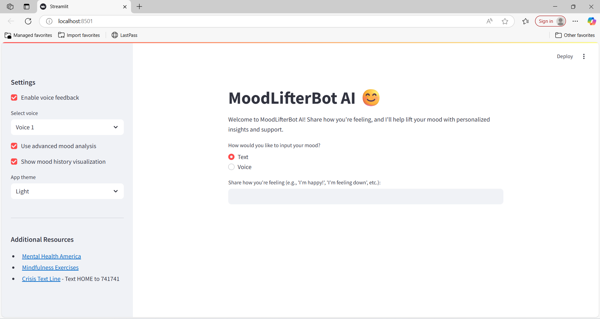
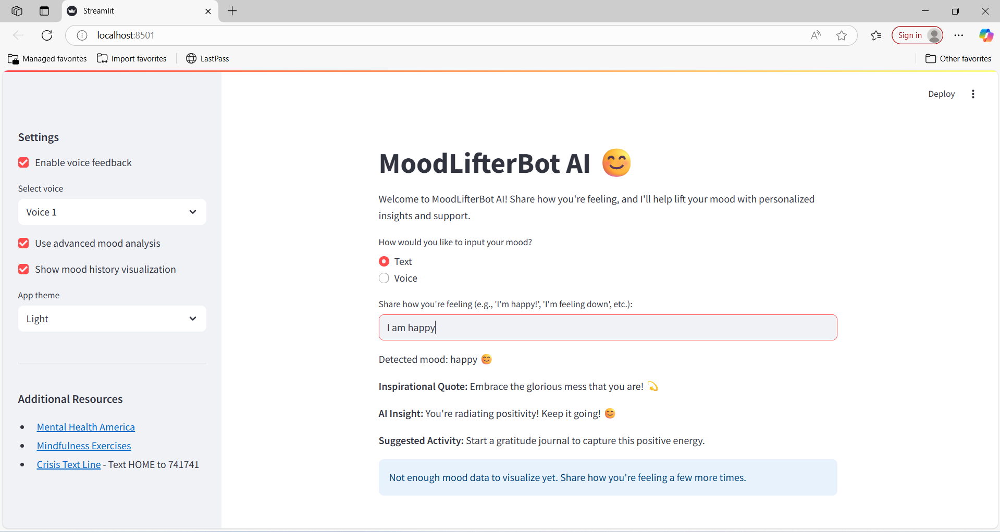
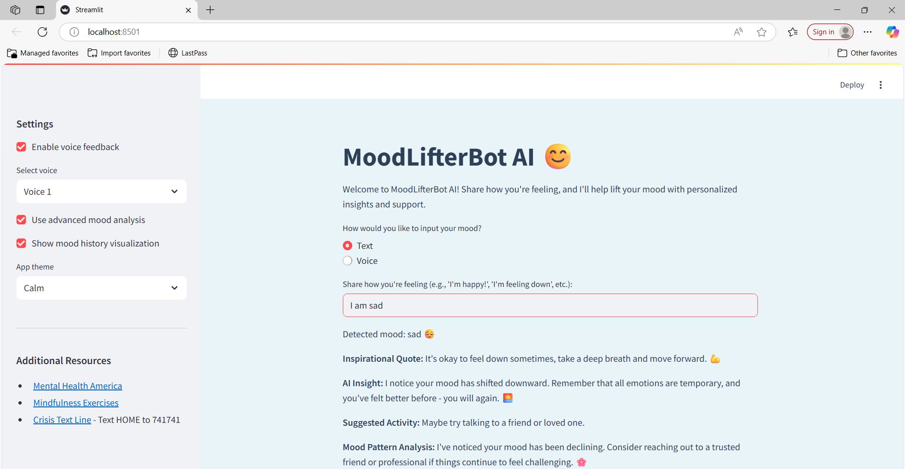
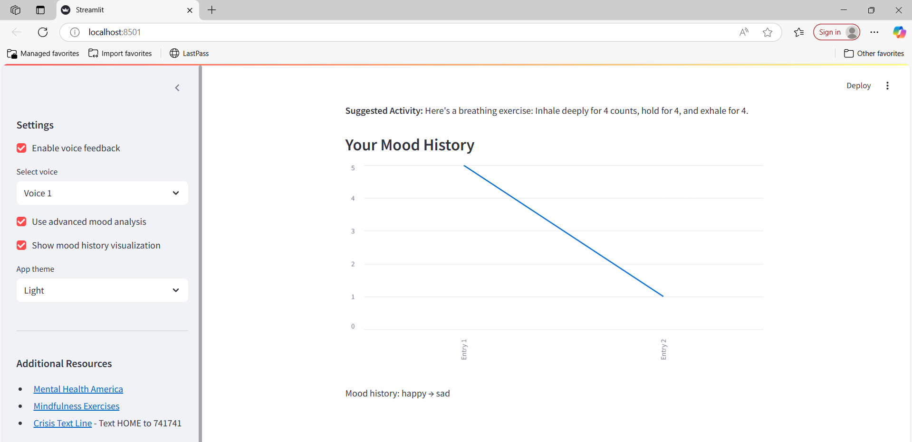

# MoodLifter AI 🤖

An AI-powered emotional wellness assistant built with Streamlit and NLP.  
MoodLifter detects user mood and responds with personalized quotes, coping suggestions, and even mood history charts — all powered by machine learning.

---

## 🌟 Features

-  **Mood Detection** via voice or text (Naive Bayes + TextBlob)
-  Personalized motivational quotes & self-care suggestions
-  Voice input + Voice output using `SpeechRecognition` & `pyttsx3`
-  Mood history tracking & visualization
-  Light & Dark theme toggle
-  Settings panel to customize experience
-  Built entirely with **Streamlit**

---

## 📸 Demo





---

## 🛠️ Tech Stack

- **Python**
- **Streamlit**
- **NLP**: TextBlob, Naive Bayes
- **Hugging Face API** (optional)
- **SpeechRecognition** + `pyttsx3` (voice features)
- **matplotlib** for data visualization

---

## 🧪 How to Run

1. Clone the repository:
   ```bash
   git clone https://github.com/monikaaaa1111/moodlifter-ai
   cd moodlifter-ai
